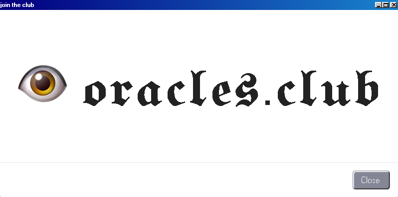

<!-- PROJECT SHIELDS -->
<!--
*** I'm using markdown "reference style" links for readability.
*** Reference links are enclosed in brackets [ ] instead of parentheses ( ).
*** See the bottom of this document for the declaration of the reference variables
*** for contributors-url, forks-url, etc. This is an optional, concise syntax you may use.
*** https://www.markdownguide.org/basic-syntax/#reference-style-links
-->
[![Contributors][contributors-shield]][contributors-url]
[![Forks][forks-shield]][forks-url]
[![Stargazers][stars-shield]][stars-url]
[![Issues][issues-shield]][issues-url]
[![MIT License][license-shield]][license-url]


<!-- PROJECT LOGO -->
<br />
<p align="center">
  <a href="https://github.com/Dragonfly-Capital/oracles.club">
    
  </a>

<br/>
  <h3 align="center">𝖔𝖗𝖆𝖈𝖑𝖊𝖘.𝖈𝖑𝖚𝖇</h3>

  <p align="center">
    the only club you need to join for ethereum oracle data
    <br />
    <a href="https://github.com/Dragonfly-Capital/oracles.club"><strong>Explore the docs »</strong></a>
    <br />
    <br />
    <a href="https://github.com/Dragonfly-Capital/oracles.club">View Site</a>
    ·
    <a href="https://github.com/Dragonfly-Capital/oracles.club/issues">Report Bug</a>
    ·
    <a href="https://github.com/Dragonfly-Capital/oracles.club/issues">Request Feature</a>
  </p>
</p>


<!-- TABLE OF CONTENTS -->
## Table of Contents

* [About the Project](#about-the-project)
  * [Built With](#built-with)
* [Getting Started](#getting-started)
  * [Prerequisites](#prerequisites)
  * [Installation](#installation)
  * [Usage](#usage)
  * [Gulp Tasks](#gulptasks)
* [Contributing](#contributing)
* [License](#license)
* [Contact](#contact)
* [Acknowledgements](#acknowledgements)


<!-- ABOUT THE PROJECT -->
## About The Project

[![Product Name Screen Shot][product-screenshot]](https://example.com)


### Built With

* []()
* []()
* []()


<!-- GETTING STARTED -->
## Getting Started

To get a local copy up and running follow these simple steps.

### Prerequisites

This is an example of how to list things you need to use the software and how to install them.
* npm
```sh
npm install npm@latest -g
```

### Installation

To begin using this template, choose one of the following options to get started:

-   Clone the oracles.club: `git clone https://github.com/Dragonfly-Capital/oracles.club.git`
-   [Fork, Clone, or Download on GitHub](https://github.com/Dragonfly-Capital/oracles.club)

### Usage

After installation, run `npm install` and then run `npm start` which will open up a preview of the template in your default browser, watch for changes to core template files, and live reload the browser when changes are saved. You can view the `gulpfile.js` to see which tasks are included with the dev environment.

### Gulp Tasks

-   `gulp` the default task that builds everything
-   `gulp watch` browserSync opens the project in your default browser and live reloads when changes are made
-   `gulp css` compiles SCSS files into CSS and minifies the compiled CSS
-   `gulp js` minifies the themes JS file
-   `gulp vendor` copies dependencies from node_modules to the vendor directory

You must have npm installed globally in order to use this build environment. This theme was built using node v11.6.0 and the Gulp CLI v2.0.1. If Gulp is not running properly after running `npm install`, you may need to update node and/or the Gulp CLI locally.


<!-- CONTRIBUTING -->
## Contributing

Contributions are what make the open source community such an amazing place to be learn, inspire, and create. Any contributions you make are **greatly appreciated**.

1. Fork the Project
2. Create your Feature Branch (`git checkout -b feature/AmazingFeature`)
3. Commit your Changes (`git commit -m 'Add some AmazingFeature'`)
4. Push to the Branch (`git push origin feature/AmazingFeature`)
5. Open a Pull Request


<!-- LICENSE -->
## License

Distributed under the MIT License. See `LICENSE` for more information.


<!-- CONTACT -->
## Contact

Tom Schmidt - [@tomhschmidt](https://twitter.com/tomhschmidt) - tom@dcp.capital

Project Link: [https://github.com/Dragonfly-Capital/oracles.club](https://github.com/Dragonfly-Capital/oracles.club)


<!-- ACKNOWLEDGEMENTS -->
## Acknowledgements

* []()
* []()
* []()


<!-- MARKDOWN LINKS & IMAGES -->
<!-- https://www.markdownguide.org/basic-syntax/#reference-style-links -->
[contributors-shield]: https://img.shields.io/github/contributors/Dragonfly-Capital/oracles.club.svg?style=flat-square
[contributors-url]: https://github.com/Dragonfly-Capital/oracles.club/graphs/contributors
[forks-shield]: https://img.shields.io/github/forks/Dragonfly-Capital/oracles.club.svg?style=flat-square
[forks-url]: https://github.com/Dragonfly-Capital/oracles.club/network/members
[stars-shield]: https://img.shields.io/github/stars/Dragonfly-Capital/oracles.club.svg?style=flat-square
[stars-url]: https://github.com/Dragonfly-Capital/oracles.club/stargazers
[issues-shield]: https://img.shields.io/github/issues/Dragonfly-Capital/oracles.club.svg?style=flat-square
[issues-url]: https://github.com/Dragonfly-Capital/oracles.club/issues
[license-shield]: https://img.shields.io/github/license/Dragonfly-Capital/oracles.club.svg?style=flat-square
[license-url]: https://github.com/Dragonfly-Capital/oracles.club/blob/master/LICENSE.txt
